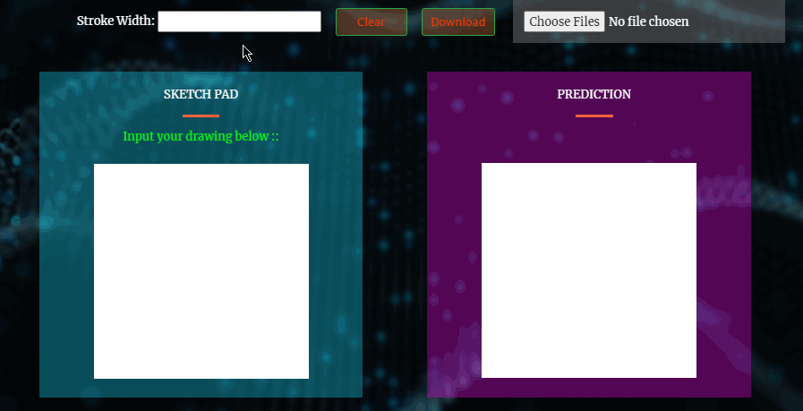
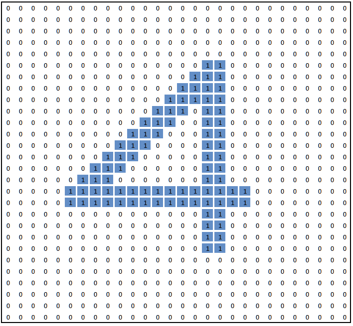

# Hand-Written Digit Prediction
## Deep Learning with Convolutional Neural Network

Team Member - Henry Le, Ekin Kaplan, Gini Arimbi, Panarat Duke.

<a href="http://ec2-3-20-237-129.us-east-2.compute.amazonaws.com">**Click here**</a> for final product deployed on AWS EC2 with Docker.

**NOTE:** At the current release, this website works only on Desktop or Laptop with screen larger than 13". Small Tablets and Phones are not supported.

## 1. Background 

Machine Learning Technologies have been rapidly developed in the last decade. This advancement allows model predictions to be exponentially more accurate.

In this project, Machine Learning was taken out of its traditional way into more sophisticated level which employs advanced Deep Learning model known as Convolutional Neural Network (CNN), in conjunction with the widely-known effective Dense Network. The beauty of this project is not only allowing machine to learn human handwriting but also allowing human to understand how the machine learns and how predictions are made in a certain way, thanks to the real-time interaction and prediction developed in this project.

    

    

## 2. The Question... Why

* **Why image prediction?** Facial Recognition and Object Detection have always been a tremendous inspiration for the team. The curiosity of how these are even possible brought the team together for making great things happened in this project.

* **Why CNN?** CNN was chosen for its proven accurate predictions up to 98% with just a few layers of Conv2D and Dense Networks, within 5 training epochs. The power of CNN lies within its capability to "scan" the image in 2D instead of 1D space (comparing to Dense Network). Together with Dense Network, CNN creates the unmatchable model for any image prediction/ classification.

## 3. Training Data, Model Architecture & Training Process, and WorkFlow
### Dataset
* MNIST dataset, thanks to Prof. Yann LeCun. Dataset was loaded from Keras built-in database.
* 60,000 28x28 pixel images of handwritten digits used for training, 10,000 of same size for validation. Total 70,000 images.
* All digits were centered in the frame.
* Pure white background (rgb(255, 255, 255)) and black stroke (some gray mixed due to pixelation, rgb(0, 0, 0))

### Model Training
* Each of the image features will be processed thru the network that is built based on convolutional block concepts (2+ Conv2D, Batch Normalization, Max Pooling in each block). The output consists of 10 digit classifications, which are from 0 to 9. 

    

* A closer look at the block model concept:
    * 4 blocks of Conv2D
        * 2 layers per block: 8 layers total.
        * Batch Normalization and Max Pooling per block to prevent overfitting and accelerate training speed.
    * 2 Dense layers with Drop-out features to again prevent overfitting and speed up model training.

### Image "Reading" by PC
When human is reading a number, the eyes see black ink (or any color) on a black or color paper. When PC is reading an image, all it sees is a matrix of numbers, i.e. pixel values, or rgb values. As a quick illustration below, created from a simple Excel spreadsheet with conditional formating to color cells that have values of 1 and leave white (blank) wherever zero exists. Note that 0 and 1 can be understood as binary or can be a nomalized rgb values (dividing the values by 255). Either case, same concept.

    

### Interactions of Server and Client

    

## 4. File Directory

* Main webpage written in HTML: inside **templates** folder, named **index.html**.

* Javascript (driving Canvas and AJAX): in **static/js** folder

* CSS and style-related: in  **static/css**

* Flask App and Prediction: named **application.py**,  **predict.py**

* Jupyter Notebooks used during training/ developement in the same name folder.

* During training, CNN parameters were logged and saved **./logs/deepCNN/20200718_HL/**

* Images and thumbnail: in **static/img**

* Docker Folder: consists of **Dockerfiles** and **Docker Compose** to be used for Docker Image and Container Creation and hosting on AWS EC2.

* **Auto*** files: for convenience, these auto files were created to help quickly perform environment activation & run server, or push & pull from GitHub by double clicks, improving efficiency.

## 5. Tools/ Techniques & Technologies
* **Languages:**
    *  Python 3 | Javascript ES-6 | HTML 5 |  CSS 3 | Markdown
* **Modules/ Libraries:**
    * Flask v1.1.2 | TensorFlow 2 (GPU version) | Pillow | Numpy | JSON | base64 | jQuery | NGINX (engine-X)
* **Operating System:**
    * Windows 10 Pro v2004 with WSL2 | Ubuntu v20.04 | MacOS Mojave v10.14.6
* **Clouds/ DevOps:**
    * Docker Containers | AWS EC2
* **Applications/ Software:**
    * Visual Studio Code | Windows Terminal | AWS CLI | Notepad++ | Excel (image illustration) | Google Chrome | Google Drive

## 6. Model Strengths and Limitations
### Strengths
* **Realtime prediction:**  as soon as a stroke made on canvas, the machine will make prediction. Every new stroke added to the canvas would increases the accuracy of prediction.
* **Stroke type:** stroke on canvas doesn't have to be a continuous line. Works with dotted line, too!
* **Centerness:** digit drawn doesn't have to be centered; can be offset, althought in the MNIST dataset, numbers were all centered.
* **Stroke colors:** stroke can be in red, green, blue, dark orange - doesn't have to be black.
* **Background colors:** works with light color backgrounds such as light green, yellow, light pink, etc.

### Limitations
In this project, the team purposely enlarge the drawing canvas to 300x300px (6.7x6.7cm || 2.6x2.6in) for user convenience. It's almost impossible to draw on a canvas that is 28x28px (0.8x0.8cm || 0.3x0.3in). Then this enlarged 300px canvas will then be resized to correct size of 28px. This process leads to some limitaions as below:

* **Width of stroke:** Thinner stroke tends to make wrong prediction. The threshold for stroke width is around 2-3px. The reason is that a 2px stroke on a 300px canvas after get compressed on 28px canvas would become a 0.19px stroke! At this resolution, it is quite challenging for the model to highlight the input features enough for the prediction.

* **Background & Stroke Colors:** As mentioned above, the input dataset was built on white background and blackstroke. Thus, the more extreme deviation from the original training colors would make the prediction incorrectly. For instance, model would fail to predict on black or near black background or with white or near white (bright) stroke. Yellow backgound or blue stroke would be fine however as these are not at the extreme opposite of either.

* **Number 9 prediction:** number 9 is the most challenging to recognize in with this particular train model, which predicts more 4 and 7 more often than the correct number 9. A closer inspection on the MNIST dataset, the team found that 4, 7, 9 shares lots of common patterns of diagonal and horizontal lines! If the "belly" or circle on 9 is not rounded, chances are it is 7 per model. Or if the leg of 9 is straight down (not slanted), again number 7 instead of 9.

* **Input Image Dimensions:** If user chooses to upload a pre-made image, if the input width and height are not the same, i.e. not a square image, the model tends to make inaccurate prediction. Because the processed image for prediction is a perfect square of 28x28px, during the processing, if `width !== height`, image will be distorted, which leads to feature changes between original user upload and processed images. 

* **Image vs. Canvas Ratio:** The threshold is around 25-30%, i.e. the number has to occupy about 25-30% of the canvas surface area for a good prediction. As after being resized to even smaller 28px square, the number would become so small that is challenging for the model to effectively highlight the features for prediction. 

**Model-related limitation:** Re-training model has potential of changing the prediction, i.e. first model predicts right, then next rerun predicts number wrong.

## 7. Project Challenges

* **CNN Design:** 
    * Selecting optimal parameters for kernels, strides, pooling layers, batch normalization and drop-outs to mitigate over fitting, and accelerate model coverging was just mere trials and errors, and very subjective to the designer. However, after following recommendations from Dr. Jon Krohn in one of his articles, team successfully selected optimal parameters afters some minor tweaks.
    * Padding was added to help retain dimensions of outputs to build a deeper network.

* **Hardware for Model Training:** due to multiple layers with 20 millions parameters, a Graphics Processing Unit (2560 CUDA Cores) was employed together with a Central Processing Unit (CPU Quad-core) to be able to handle the training efficiently. GPU could get the model trained (5 epochs) within 2 minutes while CPU would take 2.5 hours.

* **AJAX:** team encountered the challenge of how to transform pixel image data in rgb values to something more "server" friendly. Base64 encoding was chosen. Then solving the challenge of how to pack the base64, sent to server and request reponse with prediction. It was a complex process that the solutions included functional oritented programming together with object oritented programming to make the seemingly impossible at first be possible.

* **Canvas Creation:** the first challenge of front-end was to make a canvas that is versatile enough to either allow user drawing directly on or display uploaded image. Multiple techniques were employed including mouse event listener, canvas draw function, new image upload event listener, automation programming to trigger corresponding functions for sending and receiving prediction from server.

## 8. Future Developement Opportunities
* **RGB Sliders:** For user to observe how the canvas parameters: stroke color, background color could potentially affect the prediction, a couple of RGB sliders can be created to enhance interation/ user experience. User can play with different color of background and stroke and see how that would affect the model prediction.

* **Create new dataset:** The limitations stated above could be solved if a training dataset has larger iamge dimensions. A new dataset could be easily created from the canvas, downloaded, classified and feed into the network. Also, instead of grayscale, RGB mode could be used for training the model - which can help eliminate problem with canvas colors.

* **Utilizing more advanced techniques:** Isolation block technique can be used to first identify where the digit is on the canvas, then cut that section off from canvas, eliminate all noises (white space background), add small padding, center the image before feed through the model. This would help eliminate issue with canvas/ digit area ratio or even mismatch between width and height.

* **Small screens:** Currently, the CSS format in this project is working only on screens that are larger than 13". Future developement would needs to use `@media ` query to adjust elements to work well with smaller screens like those of tablets or cellphones.

## 9. How to Use
* Clone the repository down to local PC.
* If running on local PC without using Docker Containers:
    * Create new environment and install modules/ packages needed from **requirements.txt**.
    * Activate the environment, go to **Docker Master**, then to **convnn**.
    * In the **application.py** file, delete `host='0.0.0.0'`, save the file.
    * When Flask "mini-server" is up and running, program is accessed via `http://127.0.0.1:5000/` (default flask).
* If running by Docker Container:
    * Go to **Docker Master**.
    * No need to delete `host='0.0.0.0'`.
    * Run command `docker-compose up -d --build`.
    * Since Docker **nginx** is configured to re-route port 80 to localhost, program can be accessed thru web browser with simple address `localhost` without specified port.
