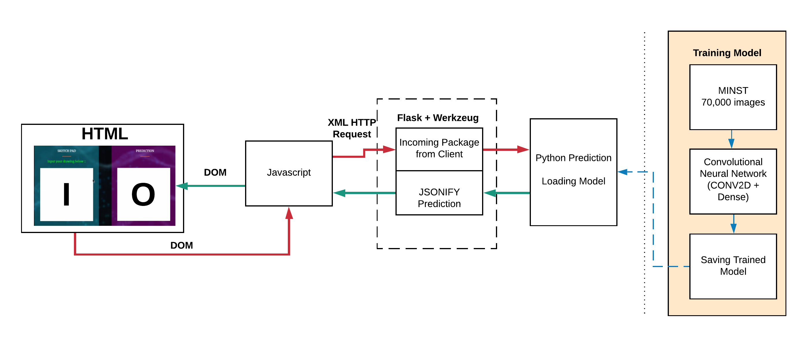
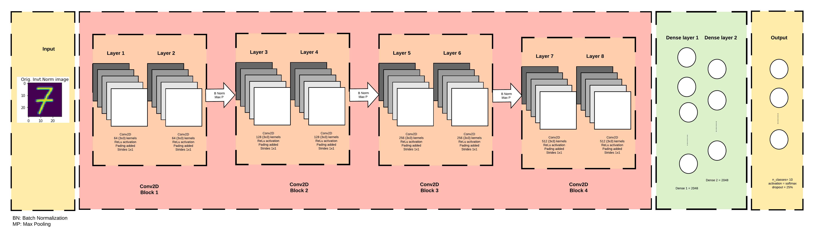

# Project 3 - Convolutional Neural Network

Team Member - Henry Le, Ekin Kaplan, Gini Arimbi, Panarat Duke

Data Analytics Bootcamp - Rice University

<a href="#">Click here for our website</a>

    

### 1. Background 

**Project Background:** Machine Learning Technology Field has been rapidly developed in the last decade. The advancement allows model predictions to be exponentially more accurate.
In this project, we took Machine Learning out of its traditional way into more sophisticated level which employs advanced Deep Learning model known as Convolutional Neural Network (CNN). CNN was chosen for its proven accurate predictions up to 98% with just a few layers of Conv2D and Dense Networks.
Basically, Conv2D in this project works as a "scanner" to continously read and processed image pixels, highlight features of each digit in the 2D space intead of 1D as the Dense network, which is better and more common for analyzing visual imagery.

**Why we chose image prediction:** We are interested to learn more about how image processing works. 

**Data Source:** MINST Dataset. Link:  http://yann.lecun.com/exdb/mnist/

**Why we chose CNN:** CNN was chosen for its proven accurate predictions up to 98% with just a few layers of Conv2D and Dense Networks.

****

### 2. Model Architecture and Process

This is the flow of the project. 

This is the sequence of layers. The input is 28x28 pixel image (both from canvas or pictures uploaded) and the output will be 10 class prediction, digit between 0 to 9. 

The model summary is the following. In total, the model consists of almost 20 million parameter.  

    

### 3. File Directory

HTML File is located inside `templates` folder with `index.html` as the main page.

Javascript is located insider `static/js` folder

CSS and style-related files are located inside `static/css`

Flask API located in `application.py` `predict.py` in main folder

CNN Model is `CNN-Blocks-Training.ipynb`in main folder

CNN Model is `Convolutional-NN/logs/deepCNN/20200718_HL/`

Images and thumbnail files will be under `static/img`

Link to the website 

**Technology Applied**  

Languages: Python, Javascript, HTML/ CSS, Markdown.
Modules/ Libraries: Flask, TensorFlow (GPU version), Pillow, Numpy, OS, JSON, base64. jQuery.

### 4. Results 

-The model can predict the number real time. As we add more strokes in the canvas, the machine will update the prediction better.  

-The model is able to predict the number with several background and stroke colors. 

-The model can predict group of dots and doesn't have to be a continuous line. 

### 5. Observation and Project Challenges

**Model Observation** 

There are several observation points we can obtain from the model. Some limitation of the models are the following: 

a. Width of stroke: Thinner stroke line tends to make the prediction wrong. Increase in the stroke line would help the model predict more accurately. The possible reason is that the thicker the stroke, the features of the image is highlighted better. During the resize to small pixel (28 px X 28 px), the stroke is still thick enough to be recognized by the model.

b. Color contrast: CNN distinguish the difference based on saturation difference between background and stroke color. Stroke color doesn't have much effect on the prediction as much as the background does. Background color have significant effect on the prediction. As the background gets closer to the black, the model failed to predict accurately. In contrast, shallow neural network has limitation in recognizing stroke color and background.

c. Shape of number and image:
Number 9 is challenging to recognize in with this particular train model, which predicts more 4 and 7 more often than the correct number 9. It might be related on the pattern of diagonal and horizontal line in that number.
The original snipped file would be predicted more accurately if the image has width == height. This is due to the fact that the MNIST dataset has width == height, thus the trained model weight matrices retain the same shape.

d. Model-related observation: Re-training model has potential of changing the prediction, i.e. first model predicted right, then next rerun predict number wrong.

e. Ratio between image size and canvas size: The smaller the image, the more difficult it is to predict the number. 

**Project Challenges** 

a. Building CNN Model:
Selecting optimal parameters for kernels, strides, pooling layers, batch normalization and drop-outs to mitigate over fitting, and accelerate model coverging.
Add padding to help retain the input and output dimensions for ability to build a deeper network.
Due to the sizes of the CNN (multiple layers with 20 millions parameters), we had to utilize the Graphics Procssing Unit (2560 CUDA Cores) to be able to handle the training.

b. HTTP Request | AJAX: finding solutions on how to pack the image package from client browser in a base64 encoded string, jsonify it and send to server. Then jasonify the response from server and send it back to client computer.

c. Building the Drawing Canvas: to allow for user drawing input or uploadind a pre-made digit picture. Utilizing JS with Event Listening to capture user mouse position, draw on the canvas and export in a base64 format.

**Future Recommendations** 
* Training the model. 
1. We can train more several model with different parameter and compare prediction accuracy and evaluation accuracy. Hence, we can observe in detail what are the significant parameter that contribute to the accuracy of the model. 

2. For the front end side, we can build an rgb slide bar so that user can adjust the background color and see how background color would effect the prediction. 
